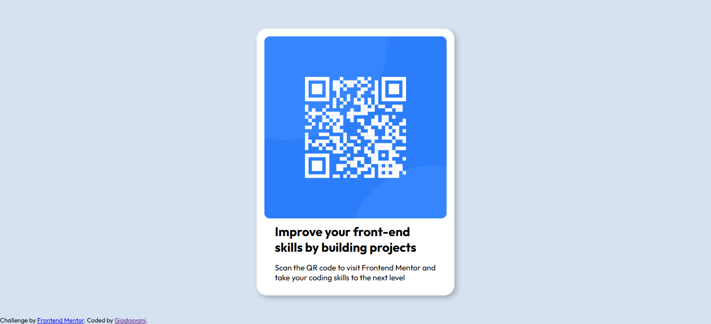

# Frontend Mentor - QR code component solution

This is a solution to the [QR code component challenge on Frontend Mentor](https://www.frontendmentor.io/challenges/qr-code-component-iux_sIO_H). Frontend Mentor challenges help you improve your coding skills by building realistic projects. 

## Table of contents

- [Overview](#overview)
  - [Screenshot](#screenshot)
  - [Links](#links)
- [My process](#my-process)
  - [Built with](#built-with)
  - [What I learned](#what-i-learned)
  - [Useful resources](#useful-resources)
- [Author](#author)

## Overview

### Screenshot



### Links

- Solution URL: [Click Here](https://www.frontendmentor.io/solutions/qr-code-component-using-flexbox-uoBJM_A-ip)
- Live Site URL: [Click Here](https://giodosvani.github.io/qr-code-component-frontendmentor/)

## My process

  -- To make the project the closier possible to the reference, i started understanding the HTML part, organizing what should be, and where it should be. It's a short challenge, so i didn't get too long to do it. After making sure the HTML document where done, i get to CSS file, and started from the Bigger and most obvious problems to the minor ones.
  -- I needed: A big white card, centralized with a image, a title and some text. Using FlexBox it is really easy to make it responsible, so when i leave the "mobile" size on the browser, it worked automatically to bigger screens.

### Built with

- Semantic HTML5 markup
- CSS custom properties
- Flexbox
- Mobile-first workflow

### What I learned

  -- I'm returning my studies and this challenge helped me to remember how to to get the things done using CSS.
 

```css
:root {
--Slate300: #d6e2f0;
--Slate500: #68778d;
--Slate900: #1f3251;
}
```


### Useful resources

- [Stack Overflow](hhttps://stackoverflow.com/questions/2325850/h1-h6-font-sizes-in-html) - This helped me finding a confortable size for the H1 tag.

## Author

- Website - [Add your name here](http://giodosvani.github.io/portfolio/)
- Frontend Mentor - [@Giodosvani](https://www.frontendmentor.io/profile/Giodosvani)


